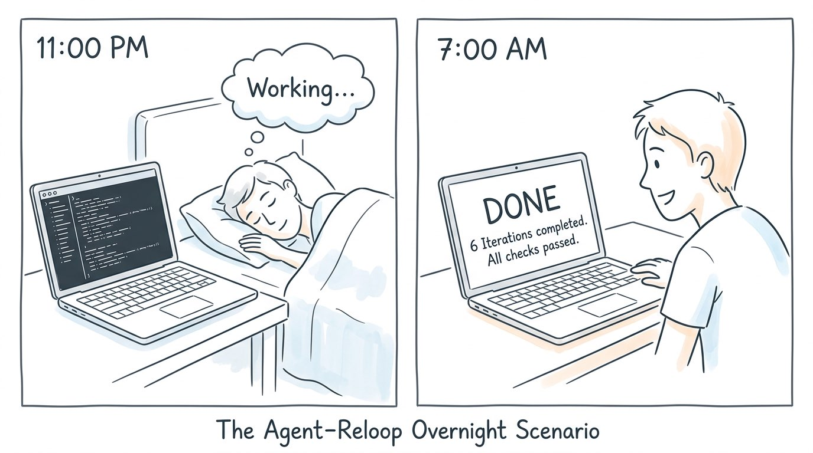
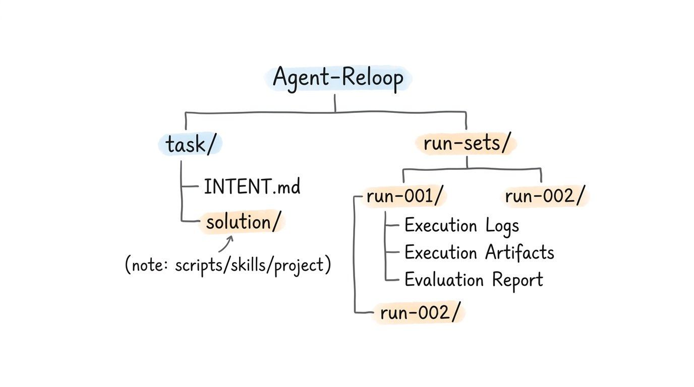

# Agent-Reloop

> **Imagine this:** It's 11 PM. You spend 10 minutes telling the framework what you want — a data pipeline, a set of API endpoints, whatever. You define a few evaluation criteria, hit run, and go to sleep. When you wake up at 7 AM, you open your laptop. The agent has gone through 6 rounds of execution and self-correction overnight. All L0/L1/L2 checks are green. Every round is committed to Git. The solution is sitting in `task/solution/`, ready for review. You just slept through the entire development cycle.
>
> That's the idea behind Agent-Reloop.



---

A universal self-iterating framework for AI Agents. It orchestrates an **execute → evaluate → iterate** loop so any task can run automatically until it passes acceptance criteria.

Reloop doesn't generate business logic — it provides the loop skeleton. Plug in any task, define what "done" looks like, and let the agents iterate until they get there.

## Key Features

- **Two-Phase Architecture** — human-in-the-loop initialization + fully automated iteration
- **Multi-Agent Support** — swap between Claude Code, Codex, Gemini, or any CLI-based agent via a unified Driver interface
- **Three-Layer Evaluation** — L0 (precondition) → L1 (deterministic) → L2 (semantic), with short-circuit logic
- **Auto-Commit per Round** — every iteration is checkpointed in Git for full traceability

## How It Works


The framework has two phases — **Init** (human-in-the-loop) feeds into **Iteration** (fully automated Python loop), all running on top of pluggable Drivers.

## Directory Structure



```
project-root/
├── task/                        # Task zone
│   ├── INTENT.md                # What to achieve
│   └── solution/                # The evolving solution (scripts/skills/project/...)
│
├── run-sets/                    # Asset zone — one folder per iteration round
│   ├── run-001/
│   │   ├── logs/                # Execution logs
│   │   ├── artifacts/           # Execution output (final, not intermediate)
│   │   └── eval-report/         # L0/L1/L2 evaluation results
│   ├── run-002/
│   └── ...
│
├── drivers/                     # Agent CLI adapters (Python)
├── specs/                       # Design specifications
└── docs/                        # Architecture & how-it-works documentation
```

## Quick Start

> **Status**: The framework is currently in the design phase. The specs are finalized; implementation is in progress.

### 1. Initialize a Task

The init phase is agent-driven and interactive. Three built-in **Meta Skills** walk you through:


| Step | Meta Skill          | Output               | Purpose                            |
| ---- | ------------------- | -------------------- | ---------------------------------- |
| 1    | INTENT Generator    | `task/INTENT.md`     | Define what the task is            |
| 2    | Evaluator Generator | Eval Skill + scripts | Define how to verify success       |
| 3    | Mocker              | Mocked artifacts     | Validate the evaluator makes sense |


### 2. Run the Iteration Loop

Once initialization is complete, start the automated loop:

```bash
# (planned CLI — not yet implemented)
reloop run --driver claude-code --workdir ./task
```

The Python loop will:

1. Set up an empty `run-xxx/` directory
2. Call the **Executor** (Agent + INTENT + last eval feedback)
3. Call the **Evaluator** (Agent + artifacts + eval skill)
4. Call the **Checker** (Agent + eval report → pass/fail)
5. If failed, loop back; if passed, exit

### 3. Review Results

Each round is committed to Git and stored in `run-sets/run-xxx/`. You can inspect execution logs, artifacts, and evaluation reports for any round.

## Driver Interface

Drivers adapt different Agent CLIs to a unified interface:

```python
class Driver:
    def run(self, prompt: str, workdir: str) -> str:
        ...
```

```bash
driver run --prompt "..." --workdir "..."
```


| Driver      | Agent           | Priority     |
| ----------- | --------------- | ------------ |
| Claude Code | Claude Code CLI | High (first) |
| Codex       | Codex CLI       | Medium       |
| Gemini      | Gemini CLI      | Medium       |


Skills are injected directly into the prompt — no separate `--skill` parameter.

## Design Docs


| Document                                     | Content                       |
| -------------------------------------------- | ----------------------------- |
| [specs/00-overview.md](specs/00-overview.md) | Architecture overview         |
| [specs/01-adr.md](specs/01-adr.md)           | Architecture Decision Records |
| [docs/how-it-works.md](docs/how-it-works.md) | Core working principles       |


## License

TBD