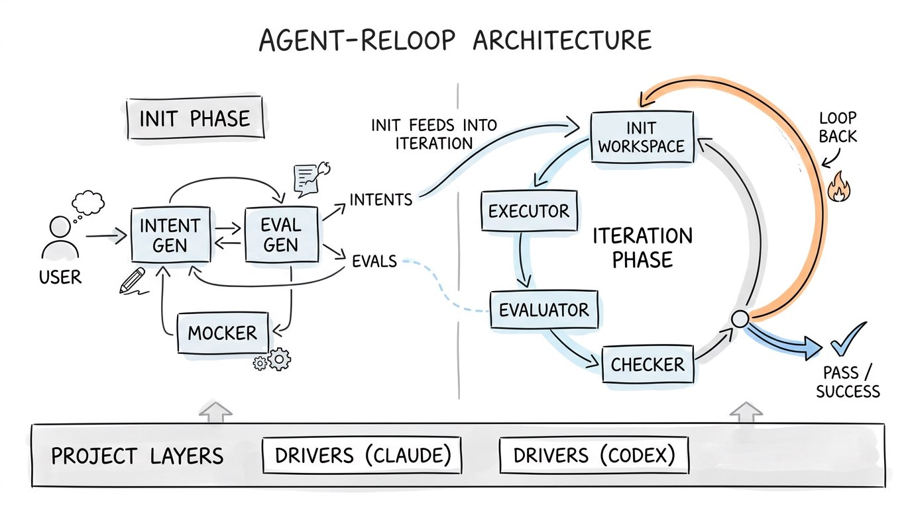
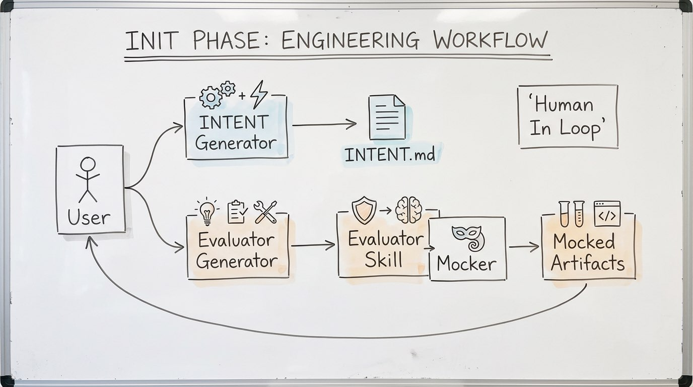
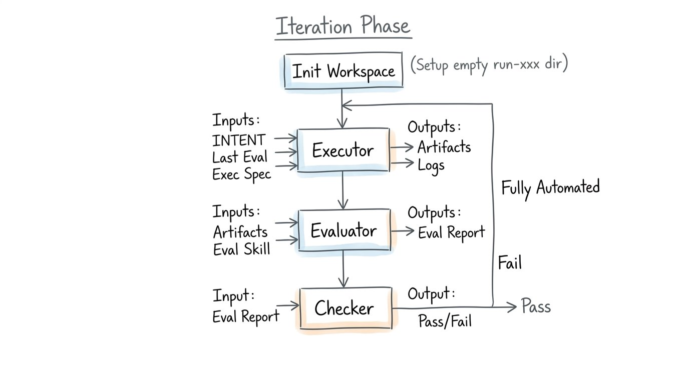
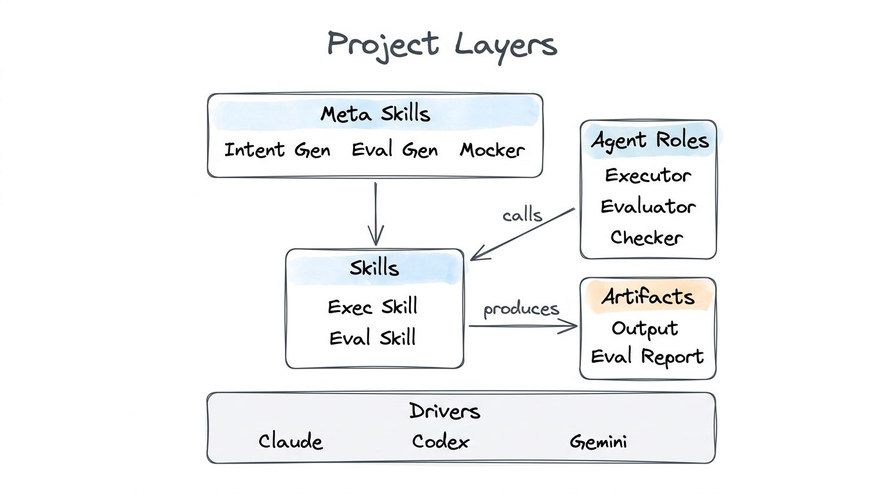

# How Agent-Reloop Works

This document explains the core working principles of the Agent-Reloop framework.

---

## The Big Picture

Agent-Reloop solves one problem: **how to make an AI Agent reliably complete a task by automatically retrying and improving until quality criteria are met**.



The framework splits this into two phases:


| Phase              | Driver             | Human Involvement           | Goal                                      |
| ------------------ | ------------------ | --------------------------- | ----------------------------------------- |
| **Initialization** | Agent-driven       | Interactive (Human In Loop) | Define *what* to do and *how* to verify   |
| **Iteration**      | Python code-driven | None (fully automated)      | Execute, evaluate, fix, repeat until pass |


---

## Phase 1: Initialization

The init phase answers three fundamental questions:


| #   | Question                        | Answered By         | Output                        |
| --- | ------------------------------- | ------------------- | ----------------------------- |
| 1   | What is the goal?               | INTENT Generator    | `task/INTENT.md`              |
| 2   | How do we know it's achieved?   | Evaluator Generator | Eval Skill + L0/L1/L2 scripts |
| 3   | What does "achieved" look like? | Mocker              | Mocked execution artifacts    |


### Meta Skills

These three generators are **framework-built-in** capabilities (called Meta Skills). They are not task-specific — they exist to bootstrap any task.



**Key rules**:

- The recommended order is INTENT → Evaluator → Mocker, but they are **not a forced pipeline**. You can go back and revise any time.
- There is only **one evaluator** per task. If it's wrong, you modify it — never create a second one.
- "Locking" an artifact is a user decision, not a system enforcement.

### Three-Layer Evaluation (L0 / L1 / L2)

The Evaluator Generator produces scripts that follow a framework-defined layered structure:

```
L0: Precondition / Safety checks     ← Script
 │  (e.g., files exist? dir structure correct?)
 │  Pass? ↓   Fail? → Stop, report L0 failure
 │
L1: Deterministic verification        ← Script
 │  (e.g., output format, count, encoding)
 │  Pass? ↓   Fail? → Stop, report L1 failure
 │
L2: Semantic / Quality verification   ← LLM
    (e.g., content quality, logical consistency)
    Pass or Fail → Report
```

**Short-circuit logic**: L0 must pass before L1 runs; L1 must pass before L2 runs. This saves cost and time — no point asking an LLM to judge quality if the file doesn't even exist.

---

## Phase 2: Iteration Loop

The iteration phase is a **Python `while True` loop** — it is code, not an Agent. Agents only participate when called through Drivers.



### The Four Steps

```python
while True:
    # Step 1: Init workspace
    init_workspace(run_id)           # Create empty run-xxx/ dir

    # Step 2: Executor
    prompt = build_executor_prompt(
        intent,                      # What to do
        last_eval_result,            # What went wrong last time (empty on round 1)
        exec_spec                    # Framework rules (where to put files, logs, etc.)
    )
    driver.run(prompt, workdir)      # Agent executes the task

    # Step 3: Evaluator
    prompt = build_evaluator_prompt(
        artifacts,                   # What the executor produced
        eval_skill                   # How to evaluate (from init phase)
    )
    driver.run(prompt, workdir)      # Agent evaluates the output

    # Step 4: Checker
    prompt = build_checker_prompt(
        eval_report                  # The evaluation report
    )
    result = driver.run(prompt, workdir)  # Agent reviews: pass or fail?

    if result == "passed":
        break                        # Done!
    # else: loop back to step 1
```

### Step-by-Step Breakdown

#### Step 1 — Init Workspace

The framework (Python code) creates an empty `run-sets/run-{id}/` directory with placeholders for logs, artifacts, and the evaluation report.

#### Step 2 — Executor

The Executor is an Agent that **tries to accomplish the task**.


| Input            | Source                                                         |
| ---------------- | -------------------------------------------------------------- |
| INTENT           | `task/INTENT.md` (from init phase)                             |
| Last Eval Result | Previous round's eval report (empty on round 1)                |
| Exec Spec        | Framework-defined rules (output dirs, log paths, solution dir) |


The Exec Spec is a **framework preset** — it tells the Agent where to put things, not what to build. It's the same for every task.


| Output              | Location                      |
| ------------------- | ----------------------------- |
| Execution Artifacts | `run-sets/run-xxx/artifacts/` |
| Execution Logs      | `run-sets/run-xxx/logs/`      |
| Solution (evolving) | `task/solution/`              |


#### Step 3 — Evaluator

The Evaluator is an Agent that **judges the Executor's output** according to the Eval Skill defined during initialization.


| Input               | Source                                         |
| ------------------- | ---------------------------------------------- |
| Execution Artifacts | `run-sets/run-xxx/artifacts/`                  |
| Eval Skill          | Generated by Evaluator Generator in init phase |


It runs L0 → L1 → L2 with short-circuit logic and produces an Evaluation Report.

**Decoupled**: the Evaluator can use a **different Agent** (and therefore a different Driver) than the Executor.

#### Step 4 — Checker

The Checker is deliberately **generic and minimal**. It doesn't understand the task — it only reads the Evaluation Report and determines whether it says "pass" or "fail".

Why does this exist? Because the Eval Skill is dynamically generated and the report format may vary. The Checker acts as a stable "translation layer" that normalizes the result into a simple boolean.

### Commit After Every Round

After each complete round (execute + evaluate + check), the framework commits all changes to Git. This ensures:

- Full traceability of every iteration
- Easy rollback to any previous state
- A clear audit trail of how the solution evolved

---

## Project Layers

The framework is organized into five conceptual layers:




| Layer           | Responsibility                              | Built-in or Dynamic                       |
| --------------- | ------------------------------------------- | ----------------------------------------- |
| **Meta Skills** | Generate Skills                             | Framework built-in                        |
| **Agent Roles** | Role definitions (prompts) that call Skills | Framework preset                          |
| **Skills**      | Executable capabilities                     | Eval Skill = dynamic; Exec Skill = preset |
| **Artifacts**   | Outputs produced by Skills                  | Runtime output                            |
| **Drivers**     | Agent CLI adapters                          | Framework preset                          |


**Critical constraint**: Meta Skills only generate Skills. They never generate Agent Roles. Agent Roles are framework presets that don't change per task.

---

## Driver Architecture

Drivers are the thin adapter layer between the framework and the actual Agent CLIs.

```
Python Loop
    │
    │  driver.run(prompt="...", workdir="...")
    ▼
┌────────────────────┐
│   Driver (Python)  │
│                    │
│  - Spawns Agent CLI process
│  - Streams stdout → terminal + log file
│  - Returns output string
│  - Synchronous execution
└────────┬───────────┘
         │
         ▼
   Agent CLI (claude, codex, gemini, ...)
```

### Unified Interface

```python
class Driver:
    def run(self, prompt: str, workdir: str) -> str:
        raise NotImplementedError

class ClaudeCodeDriver(Driver):
    ...

class CodexDriver(Driver):
    ...
```

### Design Decisions

- **Skills are injected into the prompt**, not passed as a separate parameter. This keeps Drivers simple.
- **Synchronous execution only** — async is out of scope for now.
- **Streaming output**: real-time to terminal + saved to log file simultaneously.
- **Different agents for different roles**: the Executor and Evaluator can use entirely different Drivers/Agents because they are decoupled.

---

## Data Flow Summary

```
[Init Phase]
  User + Agent ──→ INTENT.md + Eval Skill + Mocked Artifacts

[Iteration Phase]
  Round N:
    INTENT + Eval(N-1) + Exec Spec ──→ Executor ──→ Artifacts + Logs
                                                        │
    Artifacts + Eval Skill ──→ Evaluator ──→ Eval Report
                                                  │
    Eval Report ──→ Checker ──→ Pass? ──→ Done
                                  │
                                Fail ──→ Round N+1
```

Each round produces a complete snapshot in `run-sets/run-{id}/`, and the solution in `task/solution/` evolves incrementally across rounds.